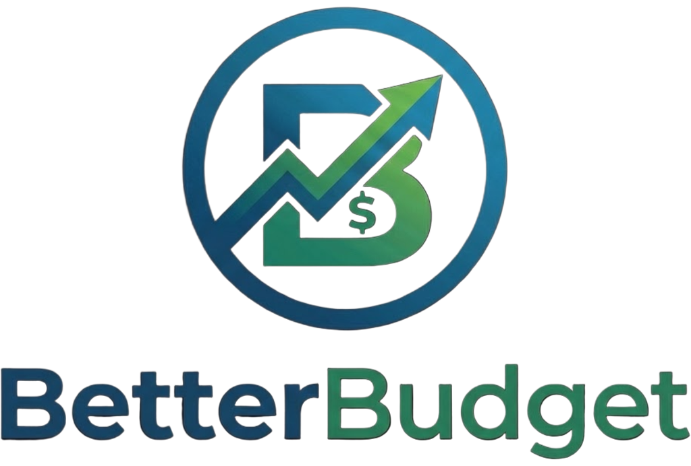

# BetterBudget

  
  

    <b>Fully local personal finance app — now available as a desktop app.</b>
  

  

    No cloud. No subscriptions. No data sharing. 
    Your financial data stays on your machine in a single encrypted file.
  

  
  
  
  

---

## About BetterBudget

BetterBudget is a comprehensive personal finance management platform designed for individuals who demand complete control over their financial data. As a fully local desktop application, all financial information—transactions, accounts, investments, and budgets—remains encrypted on your machine. There are no external dependencies, no cloud storage, and no subscription fees.

Built for modern users who value privacy, reliability, and sophisticated financial tracking, BetterBudget combines powerful analytics, intelligent automation, and enterprise-grade security in an intuitive, offline-first architecture.

---

## Core Features

### Financial Tracking & Visibility
- **Dashboard** — Real-time financial overview with income, expenses, savings rate, net worth tracking, cash flow analysis, and spending category breakdowns
- **Accounts** — Multi-asset account management for checking, savings, credit cards, brokerage, and retirement accounts with full asset/liability categorization
- **Transactions** — Comprehensive transaction ledger with advanced search, multi-criterion filtering, bulk operations, and inline editing
- **Net Worth** — Live net worth calculations with historical snapshot tracking, what-if scenario modeling, and retirement planning projections

### Budgeting & Planning
- **Budget Management** — Flexible monthly and pay-period budgeting with category limits, rollover carry-forward, and budget-based spending projections
- **Goals** — Financial target tracking with real-time progress visualization
- **Investment Tracking** — Portfolio monitoring with live market data integration (Yahoo Finance)
- **Recurring Cost Planning** — Automatic recurring expense detection and management
- **Retirement Projector** — Advanced what-if analysis with 401(k), IRA, employer matching, salary growth, and FIRE number calculations

### Intelligent Automation
- **Smart Categorization** — Rule-based categorization engine (exact match, partial match, pattern-based) with IF/THEN conditional logic
- **ML Auto-Categorization** — Machine learning–powered transaction classification that learns from your behavior (Naive Bayes)
- **Duplicate Detection** — Real-time duplicate flagging during import and historical duplicate scanning
- **Transfer Reconciliation** — Automatic internal transfer pairing and reconciliation across accounts

### Data Import & Export
- **Multi-Format Import** — CSV and Excel import with automatic bank format detection (AMEX, USAA, PayPal, Fidelity, Schwab, and generic formats)
- **Database Backup** — Full database export and import for disaster recovery and data portability
- **Bulk Operations** — Batch transaction edits, categorization, and deletion with confirmation safeguards

### Enterprise Features
- **Privacy Controls** — One-click privacy blur to hide/show monetary amounts; colorblind accessibility modes (protanopia, deuteranopia, tritanopia)
- **Offline Licensing** — RSA-4096 encrypted license validation with zero external dependencies; works completely offline after activation
- **Auto-Update System** — Built-in update checking and installation for the desktop app (installer version)
- **Recycle Bin** — Soft-delete protection with restore and permanent purge capabilities for transactions and records
- **Dark Mode** — System-aware dark theme with professional UI and custom floating scrollbars
- **Customization** — Fully configurable categories with colors, sorting, aliases, and landing page preferences

---

## Technology Stack

| Component | Technology |
|-----------|-----------|
| **Frontend** | React 18, Vite, TanStack Query, Tailwind CSS, shadcn/ui, Recharts |
| **Backend** | Node.js 18+, Express, SQLite (sql.js) |
| **Desktop** | Electron, electron-builder (NSIS installer + portable), electron-updater |
| **Analytics** | Natural (Naive Bayes), custom ML pipeline |
| **Security** | RSA-4096 encryption, JavaScript obfuscation, offline license validation |
| **Data Import** | PapaParse (CSV), xlsx (Excel), multer (file handling) |

---

## Installation

**System Requirements:**
- Windows 7 SP1 or later
- 400 MB disk space
- Valid license key required (purchase at [betterbudget.com](https://betterbudget.com))

**Download**
1. **Installer** — `BetterBudget Setup X.Y.Z.exe` — Installs to Program Files with auto-update support

Get the latest release from [BetterBudget Releases](https://github.com/jeremy15n/BetterBudget-Releases/releases).

---

## Development

For contributors and developers:

**Prerequisites:** Node.js 18+
